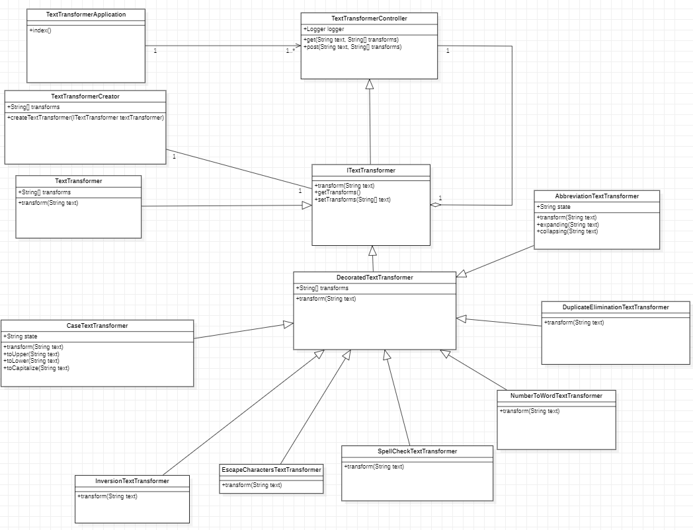

Textiv
======

## Description

Textiv is a web-based application designed to facilitate the manipulation of text through the use of various transformation options.
By accessing the locally hosted website, users can input a piece of text and select from a range of transformation options to be applied.
These options include:

- Case change (upper, lower, capitalize)
- Duplicate elimination
- Spell check
- Abbreviation expansion/contraction
- Text inversion
- Special character escape
- Number conversion to words

The chosen transformations can be arranged in a desired order and, upon selection, will be applied to the input text, producing the resulting manipulated text.

Textiv also supports a REST API, allowing users to access and manipulate text through API calls using the convention `<ip>/<text>/transform`.
This can be useful for integrating Textiv into other applications or automating text manipulation processes.

## How to build

Textiv uses Maven as its build tool. To build the project, follow these steps:

1. Make sure you have Maven installed on your machine. If you don't have Maven installed, follow the instructions on the [Maven website](https://maven.apache.org/install.html) to install it.

2. Navigate to the root directory of the Textiv repository (https://github.com/ivysochyn/textiv).

3. Run the following command to build the project:
```
mvn package
```

This will create an executable jar file under the `target/` folder with the name `io-project-architecture-<version>.jar`.

4. To run the server, use the following command (where `<version>` is version of the textiv):
```
java -jar target/io-project-architecture-<version>.jar
```

This will start the server and make the Textiv application available for use.

In addition to the `package` command, the following Maven commands are also supported:

- `test`: This command is used to test the package.
- `javadoc:javadoc`: This command is used to generate a javadoc documentation.
- `validation`: This command is used to check code style and perform text formatting.

You can run these commands by replacing `package` with the desired command in the command above. For example, to generate the javadoc documentation, you would run the following command:
```
mvn javadoc:javadoc
```

## Program structure

Textiv is structured as follows:


